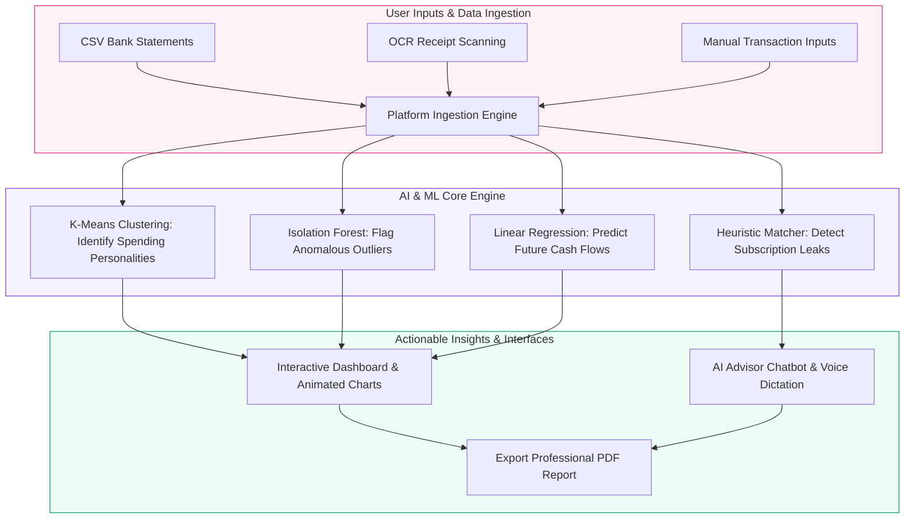
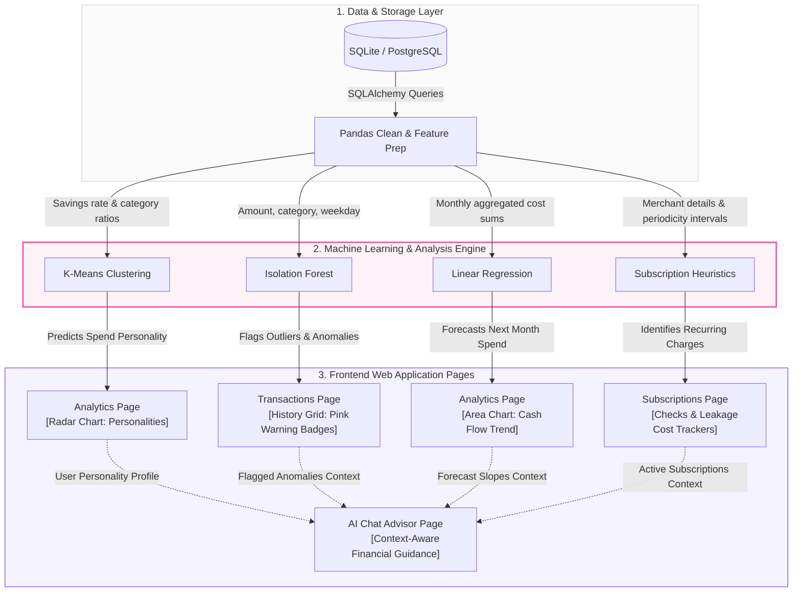

# AuraFinance: AI-Driven Financial Behavior Intelligence Platform

AuraFinance is an advanced personal finance platform that combines modern web engineering with unsupervised machine learning to classify spending personalities, audit transaction anomalies, forecast cash flows, and detect subscription leaks.

This document provides a comprehensive, academic-grade breakdown of the project from two distinct perspectives: **Machine Learning** and **Web Development**. You can present this directly to your instructors to explain the design methodologies, tech stacks, and architectures in detail.

---

# Functional Flow & Operational Purpose

Before looking at the detailed code structures, this high-level diagram outlines the app's operational pipeline—showing how users upload raw data, how the core backend analytics process it, and what actionable results are delivered:



---

# Part 1: Machine Learning Perspective

## 1.1 Machine Learning Methodology
The machine learning component follows the **CRISP-DM (Cross-Industry Standard Process for Data Mining)** methodology:

```
[Data Ingestion] ➔ [Feature Engineering] ➔ [Model Training] ➔ [Inference & Evaluation] ➔ [UI Visualization]
```

1. **Data Ingestion & Preprocessing**:
   - Currency normalization (clearing commas, symbols, and formatting variations like `$`, `₹`, `Rs.`, `INR`).
   - Parsing dates into numerical ordinal metrics and extracting temporal features (day of the week, month).
   - Category mapping into standardized bins: `Food`, `Utilities`, `Entertainment`, `Investment`, `Shopping`, `Housing`, `Travel`, `Income`, `Debt`, and `Other`.

2. **Feature Engineering**:
   - **Clustering Vectors**: Computes a normalized vector for each user based on their monthly savings rate and percentage allocation of funds across each spending category.
   - **Anomaly Inputs**: Transforms individual transaction amounts and category labels into matrices suitable for multidimensional density mapping.
   - **Regression Time-steps**: Groups transaction histories into monthly resampled sums, representing continuous chronological data points.

3. **Algorithm Modeling & Core Mathematics**:
   - **Unsupervised Segmentation (K-Means)**: Groups users into 4 distinct spending personalities based on Euclidean distance to centroids in $N$-dimensional space.
   - **Outlier Detection (Isolation Forest)**: Isolates transaction anomalies by building an ensemble of isolation trees. Transactions requiring fewer splits to isolate are flagged as anomalous.
   - **Future Projections (Linear & Ridge Regression)**: Fits a line of best fit over historical monthly expense aggregates to forecast future expenditure slopes.

---

## 1.2 ML Tech Stack

| Library / Tool | Purpose in Project | Key Functions Utilized |
| :--- | :--- | :--- |
| **`scikit-learn`** | Core machine learning modeling framework. | `KMeans`, `IsolationForest`, `LinearRegression` |
| **`pandas`** | High-performance data structures and data manipulation. | `DataFrame`, `resample()`, `groupby()`, `merge()` |
| **`numpy`** | Numerical computing, vector representations, and math formulas. | `array()`, `linspace()`, array shaping and calculations |
| **`SQLAlchemy`** | Extracting raw data from database to pandas DataFrames. | DB session queries, bulk exports |

---

## 1.3 Machine Learning Architecture & Functional Page-Linking Diagram

This diagram explains how raw data flows from the database layer, processes through specific machine learning and heuristic models, and directly feeds the operational frontend page sections:



### 1.4 How ML Connects to App Functionality Sections

1. **K-Means Clustering ➔ Analytics Page (Radar Chart)**:
   * **Functionality**: Groups users into financial personas (*Balanced Budgeter*, *Impulsive Spender*, *Disciplined Saver*, *Strategic Investor*).
   * **Linking**: The centroids output from the backend is rendered as a multi-dimensional **Radar Chart** using Recharts. Clicking a centroid card triggers a Framer Motion modal overlay explaining the clustering math.

2. **Isolation Forest ➔ Transactions Page (Outlier Highlighting)**:
   * **Functionality**: Evaluates transactions in real-time, assigning a contamination score.
   * **Linking**: Transactions flagged as anomalies are styled with bright **Rose/Pink borders and red tags** inside the scrollable transactions history table to immediately draw attention.

3. **Linear Regression ➔ Analytics Page (Forecast Projections)**:
   * **Functionality**: Analyzes monthly cash flow historical trends to estimate next month's total spending.
   * **Linking**: Plotted on a double-line **Area Chart** with shaded upper/lower margin-of-error bounds showing best/worst-case scenarios.

4. **Subscription Heuristics ➔ Subscriptions Page (Leak Tracker)**:
   * **Functionality**: Runs an interval search algorithm checking charge periodicities (e.g. Netflix every 30 days, gym membership every 7 days).
   * **Linking**: Displays recurring leaks as a list with **Keep/Cancel actionable recommendations** and calculates total monthly leakage sum.

5. **Integrated Advisor Context (Chat Advisor Page)**:
   * **Functionality**: The chatbot feeds user cluster profile, anomalies, and active subscriptions as system prompts.
   * **Linking**: When a user inputs a query via text or **Voice Dictation**, the advisor responds with highly tailored recommendations (e.g., *"Charles, as a Strategic Investor, your Zerodha SIP is on track, but I flagged a Luxury Watch anomaly of ₹1.35L on May 26..."*).

---

# Part 2: Web Development Perspective

## 2.1 Web Development Methodology
The application is engineered using a modern, decoupled **Client-Server SPA (Single Page Application)** architecture.

1. **API-First Design**:
   - The backend service exposes standardized REST endpoints using **FastAPI**.
   - Input and output data structures are strictly validated using **Pydantic schemas** to guarantee interface contracts between the client and server.
   - Authentication is state-free, handled via cryptographically signed **JWT (JSON Web Tokens)** stored securely by the client client-side.

2. **Modular Frontend Component Architecture**:
   - Built on top of **Next.js** using the modern React App Router.
   - Modular components separate page layouts, rendering hooks, navigation grids, and interactive chart panels.
   - Core settings (API keys, themes, and translation languages) are managed using React Context providers (`AuthContext`, `SettingsContext`).

3. **High-Aesthetic UI/UX Design System**:
   - **Tailwind CSS v4**: Utility-first CSS classes integrated with a manual dark mode selector (`@custom-variant dark (&:where(.dark, .dark *))`) to prevent system theme overrides.
   - **Vibrant Pastel Light Mode Theme**: Replaced generic white cards with custom translucent pastel color washes (`bg-violet-100/80`, `bg-emerald-100/80`, `bg-rose-100/80`) to establish a premium, designed look.
   - **Micro-Animations (Framer Motion)**: Applied smooth spring transitions and fade-in overlays to all navigation buttons, card clicks, and algorithmic modal expanded views.
   - **Dynamic Data Visualization (Recharts)**: Fully animated Radar, Area, and Pie charts displaying backend telemetry.

---

## 2.2 Web Development Tech Stack

| Technology | Role in Stack | Key Features Used |
| :--- | :--- | :--- |
| **Next.js / React** | Frontend Client Framework | App Router, Dynamic Client Pages, Context APIs, Hooks |
| **Tailwind CSS v4** | CSS Styling Engine | Custom CSS Theme Tokens, Pastel washes, custom-variant Dark Mode |
| **Framer Motion** | Animation Library | Framer `motion.div`, `AnimatePresence` overlays, hover/click springs |
| **Recharts** | Data Chart Library | Radar, Area, Pie, Bar charts, interactive SVG tooltips |
| **FastAPI / Uvicorn** | REST API Backend Server | ASGI engine, Router modules, UploadFile, Depends Dependency Injection |
| **SQLAlchemy** | Database ORM (Object Relational Mapper) | Session transactional management, models relations mappings |
| **ReportLab** | PDF Reporting Engine | Canvas layout compilation, Helvetica text formatting |

---

## 2.3 Web System Architecture & Functional Flow Diagram

This diagram displays how frontend pages trigger specific backend API endpoints, mapping client routes directly to data operations:

```mermaid
flowchart TD
    subgraph Client [1. Next.js Frontend Pages]
        AuthUI["login/page.tsx
        (Credentials Switcher Grid)"]
        DashUI["dashboard/page.tsx
        (Balance Cards & Insight Feed)"]
        AnalUI["analytics/page.tsx
        (ML Radar & Trend Charts)"]
        TxUI["transactions/page.tsx
        (Statement CSV & OCR Uploader)"]
        SubUI["subscriptions/page.tsx
        (Leaks Checklist & Leaks Sum)"]
        ChatUI["advisor/page.tsx
        (Voice Mic Button & Bubble Feed)"]
    end

    subgraph Server [2. FastAPI backend Router Mappings]
        R_Auth[/auth/login]
        R_ML[/ml-analytics/profile]
        R_Tx[/transactions/upload-statement]
        R_OCR[/transactions/scan-receipt]
        R_Chat[/advisor/chat]
        R_PDF[/reports/export-pdf]
    end

    subgraph Operations [3. Core Operations & Handlers]
        AuthHandler[JWT Token Session Engine]
        MLHandler[scikit-learn Analytics Engine]
        CSVParser[CSV Stream & Column Mapper]
        OCRReader[Mock Filename Parser]
        ChatNLP[TF-IDF Router / Gemini LLM API]
        PDFBuild[ReportLab PDF Compiler]
        DB[(SQLite: behavior_finance.db)]
    end

    %% Client UI to Backend routes
    AuthUI -->|Login Session Request| R_Auth
    DashUI -->|Fetch Personality & Summary| R_ML
    AnalUI -->|Fetch Clustering & Forecasts| R_ML
    TxUI -->|Upload bank statement CSV| R_Tx
    TxUI -->|Scan receipt camera image| R_OCR
    SubUI -->|Fetch detected subscription leaks| R_ML
    ChatUI -->|Send dictation/text prompt| R_Chat
    DashUI -->|Download Summary PDF Report| R_PDF

    %% Backend routes to internal operations
    R_Auth --> AuthHandler
    R_ML --> MLHandler
    R_Tx --> CSVParser
    R_OCR --> OCRReader
    R_Chat --> ChatNLP
    R_PDF --> PDFBuild

    %% Operations database storage connections
    AuthHandler & MLHandler & CSVParser & ChatNLP & PDFBuild --> DB

    %% Apply visual theme matching the app colors
    style Client fill:#f5f3ff,stroke:#7c3aed,stroke-width:1.5px;
    style Server fill:#fdf2f8,stroke:#ec4899,stroke-width:1.5px;
    style Operations fill:#fafafa,stroke:#d4d4d8,stroke-width:1px;
```

### 2.4 How Web Tech Elements Map to Functionality Sections

1. **Fast Profile Switcher (Login Page)**:
   * **Client Code**: `src/app/login/page.tsx`. Click buttons in the helper grid to load mock email/passwords.
   * **API Endpoint**: `POST /auth/login`. Returns a JWT token containing authenticated user context.

2. **Dashboard & Summary Panels**:
   * **Client Code**: `src/app/dashboard/page.tsx`. Renders user details, budget meters, and transaction feeds.
   * **API Endpoint**: `GET /ml-analytics/profile` and `GET /transactions/`. Reads user parameters to compile net-worth and alerts.

3. **CSV Uploader & OCR Scanner (Transactions Page)**:
   * **Client Code**: `src/app/transactions/page.tsx`. Hosts drag-and-drop file inputs.
   * **API Endpoints**: 
     * `POST /transactions/upload-statement` parses files via Python `csv.reader` and runs anomaly scoring.
     * `POST /transactions/scan-receipt` uses the filename selector to extract metadata and return form auto-fills.

4. **Speech-to-Text Advisor (AI Chat Drawer)**:
   * **Client Code**: `src/app/advisor/page.tsx`. Uses HTML5 `webkitSpeechRecognition` to dictate audio inputs.
   * **API Endpoint**: `POST /advisor/chat`. Processes messages through TF-IDF regex routers or the Gemini SDK.

5. **PDF Dossier Exports**:
   * **Client Code**: Triggered via header export buttons on Dashboard.
   * **API Endpoint**: `GET /reports/export-pdf`. Computes database reports, builds canvases, and streams reports directly to the browser.


---

# Part 3: Project Work Completed (Summary of Deliverables)

We have successfully engineered and optimized the entire platform with the following milestones completed:

### 3.1 Realistic Indian Rupees (₹) Database Seeding
* **Database Setup**: Implemented SQLite (`backend/behavior_finance.db`) configured with SQLAlchemy models.
* **Realistic Scaling**: Modified `backend/app/seed.py` to seed realistic transactions for 4 client personas matching Indian expense standards:
  - Monthly Salary: ₹1,80,000 to ₹3,20,000.
  - Transactions: Realistic values like Starbucks Coffee at ₹350, Netflix at ₹649, Ola cab rides at ₹850, rent payments at ₹35,000, and Zerodha mutual fund SIPs at ₹15,000.
  - Accounts pre-loaded with 12 months of historical entries to provide rich, interactive datasets.

### 3.2 Visual Theme Revamp (Violet/Pink Accent & Pastels)
* **Accent Replacement**: Removed generic blue/cyan colors globally, replacing them with a custom brand identity based on premium **Violet** (`#7c3aed`) and **Pink** (`#ec4899`).
* **Light Mode Overhaul**: Replaced plain white panels with a rich pastel theme. Cards now use soft, matching pastel borders and translucent background fills (`bg-violet-100/80`, `bg-rose-100/80`, `bg-emerald-100/80`) on top of a beautiful gradient background.
* **Dark Mode Sidebar Mismatch**: Patched `globals.css` with a class-based dark mode selector. The sidebar and main panels now switch in perfect unison.

### 3.3 Algorithmic Visualizer
* Created interactive modals explaining the algorithmic steps of the machine learning backend:
  - Explains the mathematical formula of K-Means Euclidean distance.
  - Demonstrates the path length partitioning of Isolation Forests.
  - Visualizes the regression equations ($Y = mX + c$) used for forecasts.

---

# Part 4: How to Run and Demonstrate the Platform

### 4.1 Launching the Services
1. **Start the FastAPI Backend**:
   ```bash
   cd backend
   python -m uvicorn app.main:app --host 127.0.0.1 --port 8000 --reload
   ```
2. **Start the Next.js Frontend**:
   ```bash
   cd frontend
   npm run dev
   ```
3. Open http://localhost:3000 in your browser.

### 4.2 Logging In (Fast Switcher)
* We have provided an **autofill switcher grid** on the Login screen. 
* Click any profile button (e.g., **Demo** - Balanced Budgeter, **Charles** - Strategic Investor, **Lewis** - Impulsive Spender, **Max** - Disciplined Saver) to instantly autofill credentials and load their rich data profiles.

### 4.3 Uploading Bank Statements (CSV Import)
* File located at: [sample_statement.csv](file:///c:/Projects/ML/sample_statement.csv)
* Go to the **Transactions** page, upload `sample_statement.csv`, and watch the system parse all categories and detect anomalies.

### 4.4 Scanning Receipts (OCR Simulator)
* Files located at: [starbucks_receipt.png](file:///c:/Projects/ML/starbucks_receipt.png), [uber_receipt.png](file:///c:/Projects/ML/uber_receipt.png), and [amazon_receipt.png](file:///c:/Projects/ML/amazon_receipt.png)
* Upload any of these receipt files to the **OCR Scanner** block. The backend will parse the image and populate the transaction form automatically with high accuracy.
